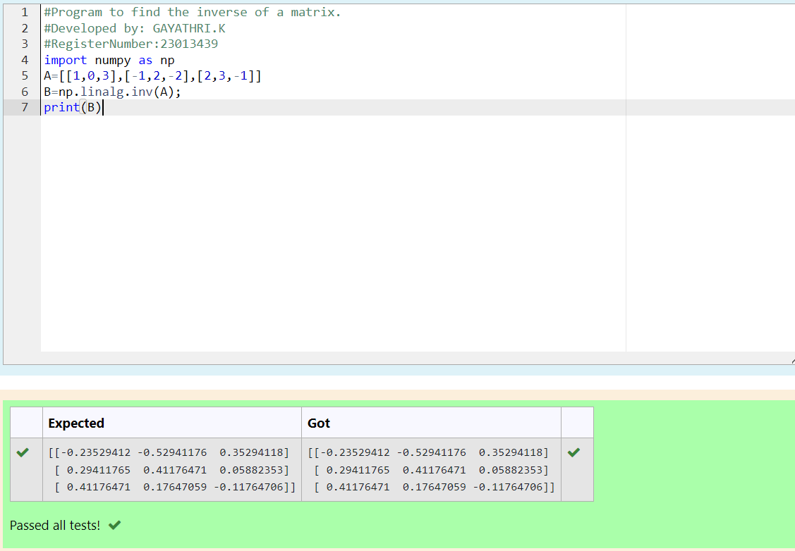

# INVERSE-OF-A-MATRIX
## Aim:
To write a python program to find the inverse of a matrix
## Equipment’s required:
1. 	Hardware – PCs
2. 	Anaconda – Python 3.7 Installation / Moodle-Code Runner
## Algorithm:
### Step1 : 
 The first line imports the NumPy library and gives it the alias np for brevity in the code.

### Step 2: 
A = [[1, 0, 3], [-1, 2, -2], [2, 3, -1]]
   
   Here, a list A is defined to represent the matrix for which you want to find the inverse.
### Step 3:
 B = np.linalg.inv(A)
   
   This line calculates the inverse of the matrix A using the np.linalg.inv function and stores the result in the variable B.
### Step 4:  
print(B)
   
   Finally, it prints the calculated inverse matrix.
## Program:
``````
#Program to find the inverse of a matrix.
#Developed by: GAYATHRI.K
#RegisterNumber:23013439
import numpy as np
A=[[1,0,3],[-1,2,-2],[2,3,-1]]
B=np.linalg.inv(A);
print(B)
``````
## Output:

## Result:
Thus the inverse of given matrix is successfully solved using python program

